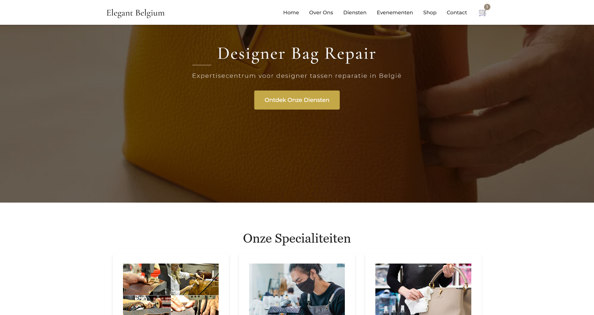
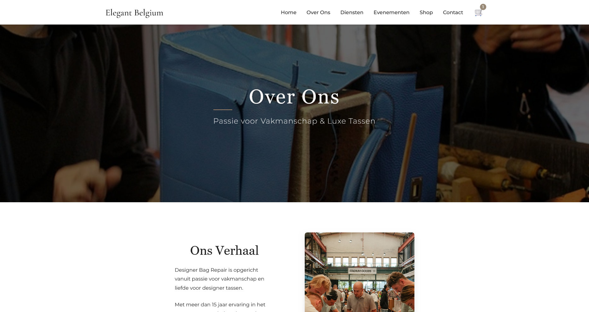
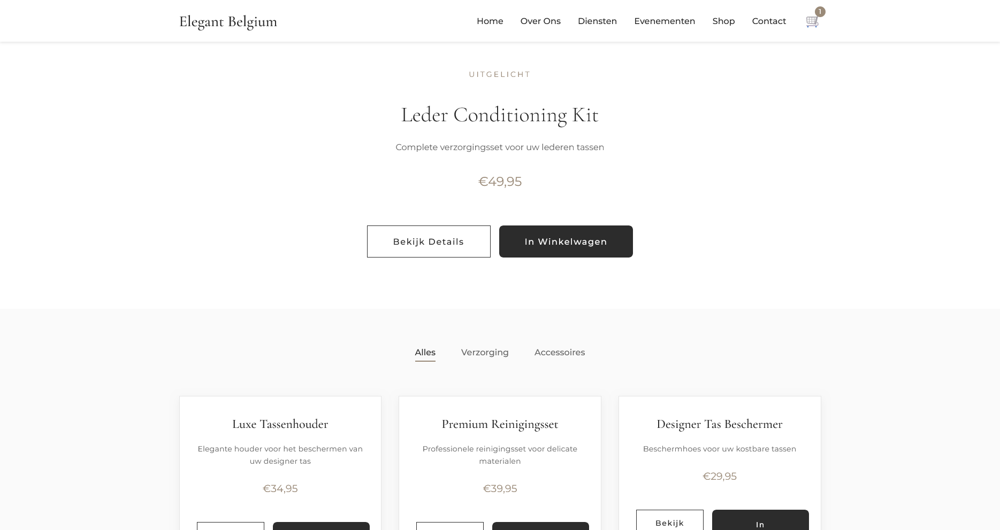

# Elegant Belgium

An elegant, minimal gateway to luxury bag care.

---

## Overview

Elegant Belgium is your destination for luxury bag mending and premium care accessories, designed to help maintain your treasured pieces for the long run.

---

## ✨ Highlights

- **Purpose:** Connects clients with expert repair services and curated accessories for luxury bags.
- **Frontend:** Built entirely in Vite + React, focusing on a refined UI and seamless UX.
- **Experience:** Fully interactive and responsive, crafted as a first full frontend project for a real-world client.
- **Market Note:** Addressing the growing (but still niche) demand for luxury bag restoration.

> **Note:** The checkout feature is currently under construction.

---

## 🔗 Live Demo

[Visit the site](https://elegant-belgium-bag-mending.vercel.app/)

---

## 🖼️ Preview

---

## Minimal. Refined. Crafted with care.
